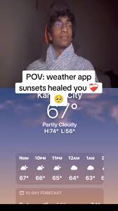
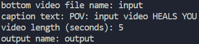

# POV: povmaker HEALED YOU❤️‍🩹🌅

have u guys ever seen those 'pov: xyz healed you' videos on reels or tiktok or whatever? well there are quite a few and i thought itd be a funny project to try and automate that with python and some libraries that composite the videos and create the text for you.

# process

i used the **MoviePy** library to resize the input video and then combine it with the video of the guy. this library also helped me add the text caption on top of the video. this part was relatively easy and straightforward. in hindsight i probably shouldve used ffmpeg or something because this is kinda slow.

i used the **Pillow** library to render the text in the tiktok font `Proxima Nova Semibold` as well as the text background as a png. this part was so insanely difficult, especially with handling multiline text because i had to calculate the width of the line and use that to determine whether or not to add that to a list of lines, which i would then render. i tried to emulate the tiktok captions as close as i could by connecting the lines together with a small rectangle above the text background in the case that its width was smaller than the line above it, and while this isnt the most accurate (also doesnt work for connecting to lines below a line), i think its good enough and a negligible detail.

# how to use

run the program in terminal with `python app.py`

you will be prompted with a series of questions. the questions on filenames (input and output files) dont require file extensions so u can just put in the names. the length of the video is restricted to 20 seconds (the length of the top video), as well as how long the bottom input video is, so u can put any number greater than either of those things.

